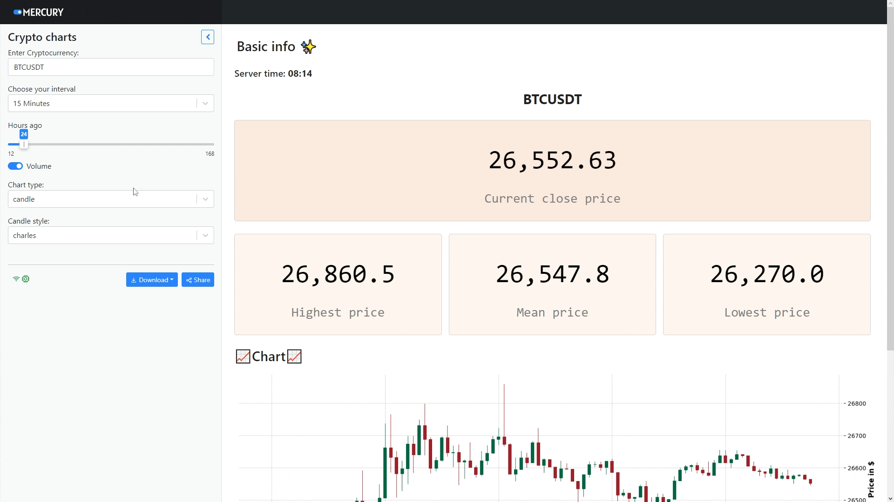
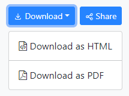

<h1 align="center">📊Crypto-charts-site</h1>

<h2 align="center">See for yourself <br> ▶ <a href="https://mmalachowski.isdatascientist.com/app/charts_notebook" target="_blank">Website</a> ◀</h2>

## Table of Contents

 - [First look](https://github.com/maciekmalachowski/Crypto-charts-site#first-look)
 - [Installation](https://github.com/maciekmalachowski/Crypto-charts-site#installation)
 - [App appearance](https://github.com/maciekmalachowski/Crypto-charts-site#app-appearance)
 - [Download you analysis](https://github.com/maciekmalachowski/Crypto-charts-site#download)

<br>
 
<h1 align="center" id="first-look"> First look 👀 </h1>

### The *Jupyter Notebook-based* application was created to analyze market data using the Binance API using the `Python-binance` library. 

### `Numpy` and `Pandas` allow user to retrieve and analyze market data. Visualization of charts is supported by `Mplfinance` which uses matplotlib.

### Open-source library *`Mercury`* allows you to add interactive widgets in jupter-notebook, so you can share your notebook as a web application, which is deployed by https://cloud.runmercury.com. 

<br>

<h1 align="center" id="installation">Installation ℹ</h1>

- First of all, clone this repository to your device. Open your shell and paste the following comands.

*URL cloning*
```
git clone https://github.com/maciekmalachowski/Crypto-charts-site.git
```
*SSH cloning*
```
git clone git@github.com:maciekmalachowski/Crypto-charts-site.git
```
<br>

- Then you need to install the requirements contained in the ``requirements.txt``.
```
pip install -r requirements.txt
```

<br>

- Create `.env` file and paste your **api** and **secret** keys from Binance API.
```
api_key = 'your_api_key'
secret_key = 'your_secret_key'
```

<br>

- After that run `internal mercury server` in the repository folder.
```
mercury run
```
Mercury will read all the notebooks contained in the folder and *automatically* display them in the browser. 

<br>

<h1 align="center" id="app-appearance"> App appearance 🔍</h1>

- Application has a *sidebar* which is responsible for all activities related to cryptocurrency analysis.
- Cryptocurrency analysis returns us information within a specified interval such as:
    - Current price
    - Highest price
    - Lowest price
    - Mean price
- It also displays a *chart*, which we can freely modify.
> ### Binance server that is being used is set to time zone UTC+0

<p align="center"></p>

<h1 align="center" id="download">Download 💾</h1>

### Mercury has option to export executed notebook to PDF or HTML. It is very simple. Click Download button in the sidebar and select desired format:
<p align="center"></p>

> ### First time PDF download will trigger `pyppeteer` download and installation if not available in the system.

#### Make sure you have Chromium installed. It can be done with the following command:
```
pyppeteer-install
```

#### More images can be found in the `media` folder.
